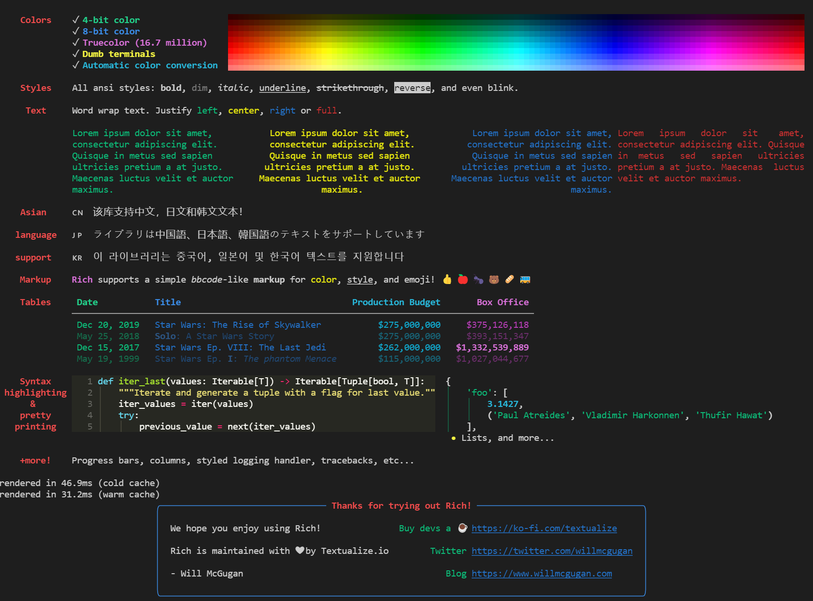
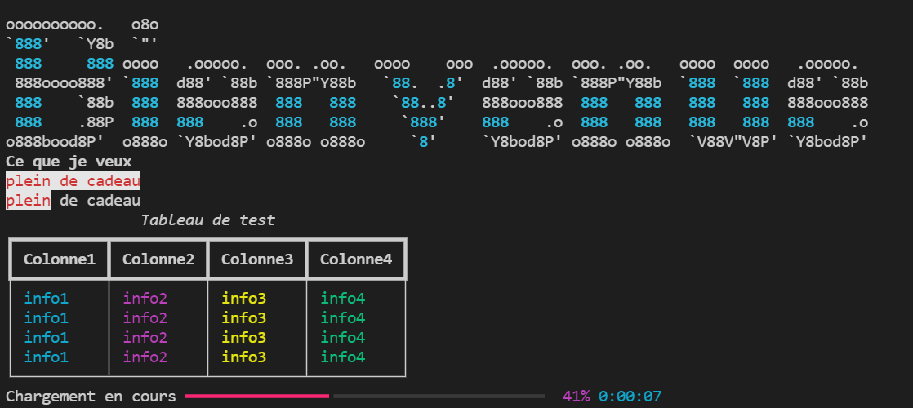

### Fonctionnalités de base pour la librairie rich

La librairie rich est une librairie qui permet de personnaliser son terminal

 

  

 

Voici un exemple de ce que l'on peut réaliser

 

  

 

Voir le code dans le fichier main pour une meilleure présentation

----------- Installation de la librairie rich
 
    # Dans le terminal

>   <code> pip install rich </code>

    # Affiche les fonctionnalités de la librairie

>   <code> python -m rich </code>

----------- Importation des fonctionnalités
 
    # Importe les fonctionnalités

<code>
from rich import print 
from rich.table import Table 
from rich.console import Console 
from rich.progress import track 
import time
</code>

----------- Fonctionnalité du print

    # ecrire en gras

<code>
print("[bold]Ce que je veux)" 
</code>

    # écrire rouge sur blanc

<code>
print("[red on white]plein de cadeau") 
</ode>

    # écrire une partie seulement rouge sur blanc

<code>
print("[red on white]plein[/] de cadeau") 
</code>

----------- Faire un tableau

    # Titre du tableau

<code>
table = Table(title="Tableau de test") 
</code>

    # Colonnes

<code>
table.add_column("Colonne1", style="cyan") 
table.add_column("Colonne2", style="magenta") 
table.add_column("Colonne3", style="white") 
table.add_column("Colonne4", style="white") 
</code>

    # lignes

<code>
table.add_row("info1", "info2", "info3", "info4") 
table.add_row("info1", "info2", "info3", "info4") 
table.add_row("info1", "info2", "info3", "info4") 
table.add_row("info1", "info2", "info3", "info4") 
</code>

    # Affichage du tableau

<code>
console = Console() 
console.print(table) 
</code>

----------- Faire une barre de progression

<code>
for i in track(range(100), description= "Chargement en cours"): 
    time.sleep(0.1)
</code>

### Mes reseaux sociaux : 

   
    

            
            
             
            
            
            
            
            
    
  

