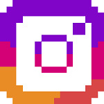

### Fonctionnalités de base pour la librairie rich

La librairie rich est une librairie qui permet de personnaliser son terminal

 

  

 

Voici un exemple de ce que l'on peut réaliser

 

  

 

----------- Installation de la librairie rich
 
    # Dans le terminal

>   pip install rich

    # Affiche les fonctionnalités de la librairie

>   python -m rich

----------- Importation des fonctionnalités
 
    # Importe les fonctionnalités

from rich import print
from rich.table import Table
from rich.console import Console
from rich.progress import track
import time

----------- Fonctionnalité du print

    # ecrire en gras

print("[bold]Ce que je veux)"

    # écrire rouge sur blanc

print("[red on white]plein de cadeau")

    # écrire une partie seulement rouge sur blanc

print("[red on white]plein[/] de cadeau")

----------- Faire un tableau

    # Titre du tableau

table = Table(title="Tableau de test")

    # Colonnes

table.add_column("Colonne1", style="cyan")
table.add_column("Colonne2", style="magenta")
table.add_column("Colonne3", style="white")
table.add_column("Colonne4", style="white")

    # lignes

table.add_row("info1", "info2", "info3", "info4")
table.add_row("info1", "info2", "info3", "info4")
table.add_row("info1", "info2", "info3", "info4")
table.add_row("info1", "info2", "info3", "info4")

    # Affichage du tableau

console = Console()
console.print(table)

----------- Faire une barre de progression

for i in track(range(100), description= "Chargement en cours"):
    time.sleep(0.1)

### Mes reseaux sociaux : 

   
    

            
            
             
            
            
            
            
            
    
  

